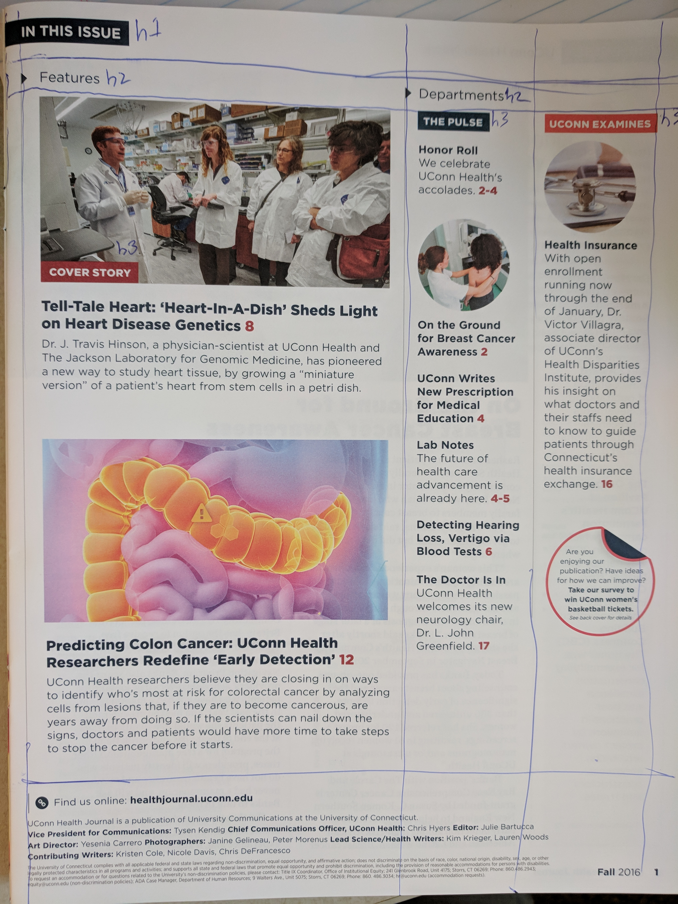

Experiment using css grid to make a mockup of the UConn Health Journal table of contents page from the Fall 2016 issue. The desktop layout somewhat follows the image below. You can see where I drew in a few guides by hand as a reference for the grid. The tablet/mobile layout is a basic single column.

